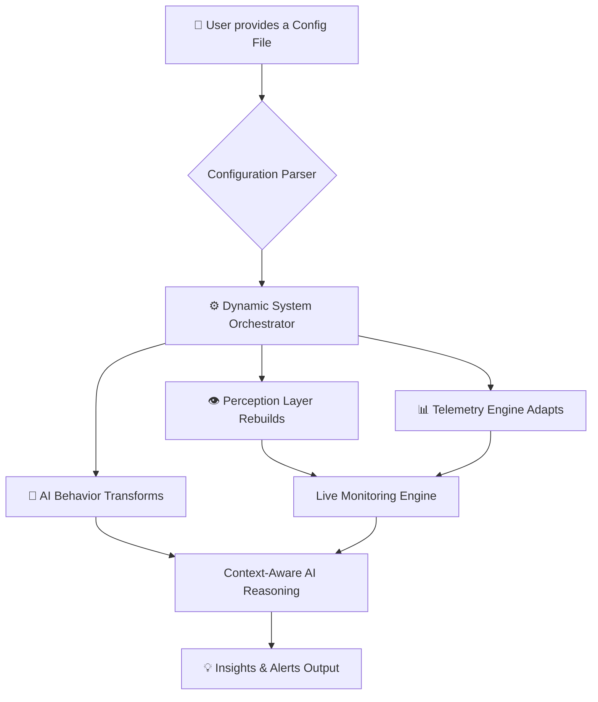
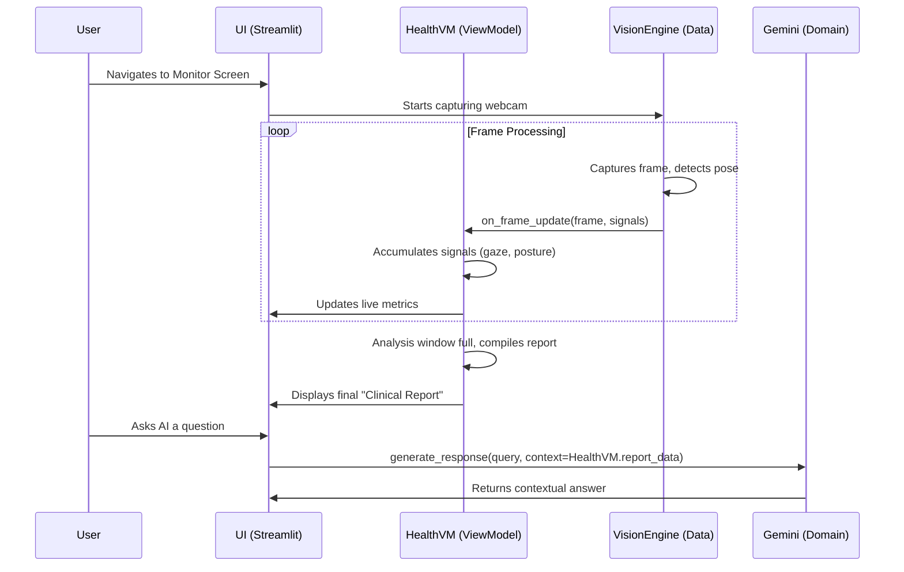
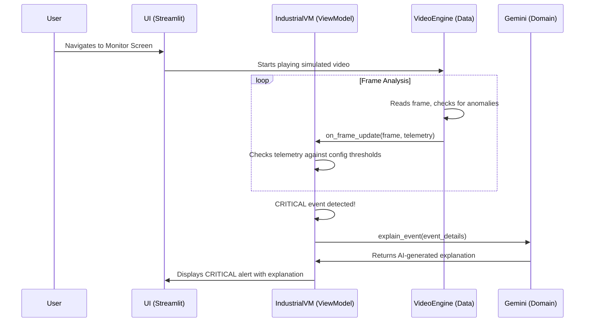
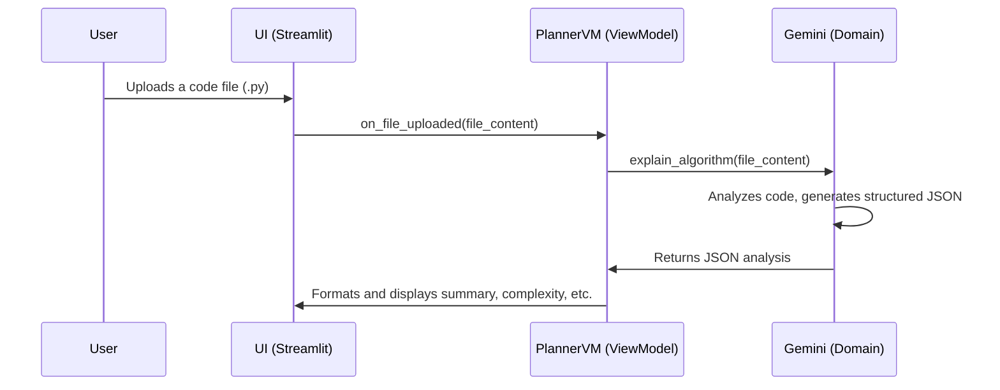

<div align="center">

# ⚡ SentinelX AI ⚡

### **One System. Infinite Adaptability. Configuration-Driven Intelligence.**


</div>

---

## 🚀 Overview

**SentinelX AI** is a next-generation **document-driven adaptive intelligence system** that dynamically reconfigures itself across multiple domains in real time. Unlike traditional AI systems that rely on static, hardcoded logic, SentinelX AI ingests structured configuration files (`.yaml`, `.txt`, `.docx`) and instantly reconstructs its entire operational pipeline:

*   **Perception Layer**: Activates the correct sensors and data sources.
*   **Telemetry Processing**: Applies domain-specific metrics and analysis.
*   **Risk Analysis Engine**: Uses custom thresholds to detect events.
*   **AI Reasoning Model**: Adopts a personality and knowledge base suited to the task.

> 🧠 **This is the core principle: one system, multiple domains, zero code changes.**

---

## ⚙️ The Core Concept: Configuration Defines Intelligence

At the heart of SentinelX AI lies a powerful idea: instead of rewriting code for each new use case, you simply describe the desired behavior in a configuration file. The system handles the rest.



This approach makes SentinelX AI incredibly flexible and scalable, capable of morphing from a human wellness monitor to an industrial safety inspector in seconds.

---

## ✨ Key Features

*   🔄 **Dynamic Architecture Switching**: The entire system pipeline reconfigures at runtime based on the loaded config.
*   🧠 **Config-Driven Intelligence**: AI behavior, knowledge, and personality are defined by a document, not code.
*   🚫 **Zero Hardcoded Pipelines**: The system has no default operational logic; it's a blank slate awaiting instruction.
*   📡 **Real-Time Telemetry Processing**: Ingests and analyzes data from live video feeds and simulated sensors.
*   🤖 **Context-Aware AI Assistant**: A voice-enabled assistant whose expertise changes based on the active mode.
*   🚨 **Dynamic Risk Detection**: Custom thresholds and rules for alerts are loaded from the config file.
*   🌐 **Multi-Domain Adaptability**: Seamlessly transitions between Health, Industrial, and Developer-focused tasks.
*   🔒 **Edge-Ready Execution**: Powered by a **Local Gemini Model** for on-device inference, ensuring privacy and offline capability.
*   🧩 **MVVM Architecture**: A clean Model-View-ViewModel design ensures scalability and maintainability.

---
## 🧠 AI Behavior Model

The AI assistant is **fully context-aware** and adapts its personality and expertise based on the active configuration. It does NOT operate generically; it **inherits its reasoning from the loaded configuration file.**

| Mode       | Behavior Style                    | Knowledge Base Focus                     | Example Interaction                               |
| :----------- | :-------------------------------- | :--------------------------------------- | :------------------------------------------------ |
| **Health**     | Calm, human-like, observational   | Ergonomics, physiology, wellness         | *"I've noticed you've been sitting still for a while. Consider taking a short break to stretch."* |
| **Industrial** | Analytical, alert-driven, precise | Machine safety, operational thresholds   | *"Critical Alert: Temperature has breached the 95°C threshold. Recommending immediate shutdown."* |
| **Planner**    | Technical, structured, logical    | Algorithms, code structure, best practices | *"This is a recursive function with O(n log n) complexity. A potential improvement is to use memoization."* |

---

## 🌐 Supported Modes In-Depth

### 🧑‍⚕️ Health Monitoring Mode

A real-time **biometric and behavioral observation system** powered by computer vision. It analyzes a user's posture, movement, and attention to provide ergonomic and wellness insights.

*   **Analyzes**: Face & pose landmarks, head position, blink rate, movement patterns.
*   **Outputs**:
    *   **Kinematic Score**: Measures micro-movements and activity levels.
    *   **Optical Retention**: Tracks gaze and attention focus.
    *   **Postural Stability**: Assesses ergonomic alignment.
    *   **Clinical Report**: Generates a detailed summary with recommendations (e.g., "Musculoskeletal Stagnation Detected").

### 🏭 Industrial Monitoring Mode

A **machine intelligence system** for detecting anomalies and safety risks in an industrial environment.

*   **Analyzes**: Simulated machinery data (temperature, vibration), and video feeds for human-machine interaction.
*   **Detects**:
    *   Unsafe human proximity to machinery.
    *   Mechanical stress threshold breaches.
    *   Anomalous operational patterns.
*   **Triggers**:
    *   **CRITICAL** alerts with AI-generated explanations.
    *   Safety warnings and risk flags.

### 💻 Developer Planner Mode

An **AI-powered code and document analysis engine** that understands logic, algorithms, and technical documentation.

*   **Analyzes**: `.py`, `.txt`, `.md`, and `.docx` files.
*   **Outputs**:
    *   **Step-by-step Explanation**: A logical breakdown of the code or document.
    *   **Time & Space Complexity**: For algorithms.
    *   **Suggested Improvements**: Identifies areas for refactoring or clarification.
    *   **Use Cases**: Describes potential applications.

---

## 📖 Configuration Deep Dive

The brain of SentinelX AI is its configuration file. The system parses this document to build its entire logic. Here is a breakdown of the `health_config.yaml` to illustrate the concept.

```yaml
# Defines the entire system's behavior for this session
mode: health

# High-level system parameters
system:
  name: SentinelX Cognitive & Physiological Monitoring System
  fps_target: 10
  description: >
    Continuous, non-intrusive monitoring of cognitive and physical state...

# Defines the rules for the risk analysis engine
thresholds:
  fatigue_index:
    warning: 0.6
    critical: 0.8
  attention_score:
    minimum: 60

# Enables/disables specific AI perception modules
ai_modules:
  fatigue_detection:
    enabled: true
    input_signals: [eye_aspect_ratio, blink_rate]
  attention_tracking:
    enabled: true

# Privacy controls for the perception layer
privacy:
  blur_faces: true
  data_retention: session_only

# Defines the context for the AI reasoning model
meta:
  system_intent: >
    Detect early signs of fatigue, disengagement, and discomfort.
  risk_model: >
    Based on deviation + duration, not single-frame anomalies.
```

*   **`mode`**: The most critical field. It tells the `ModeController` which top-level UI and ViewModel to activate.
*   **`system`**: Basic metadata that appears in the UI.
*   **`thresholds`**: These values are read directly by the ViewModel (e.g., `health_vm.py`) to determine when to change status from "Nominal" to "Warning" or "Critical." This is how risk detection is dynamically configured.
*   **`ai_modules`**: Controls which underlying vision algorithms are active. If `fatigue_detection` is `false`, the related code paths will not run.
*   **`privacy`**: These are flags that the vision engine (`health_camera_engine.py`) checks on every frame. If `blur_faces` is true, it will apply a blur filter before displaying the image.
*   **`meta`**: This text is passed directly to the **Local Gemini Model** as part of its system prompt, defining its purpose and analytical framework for the session.

---

## 🏗️ Architecture & Detailed Data Flows

SentinelX AI is built on a clean **Model-View-ViewModel (MVVM)** architecture.


```
sentinelx-ai/
├── core/             # Manages global application state and mode switching.
├── data/             # Handles data sources (vision engines, simulators, file loaders).
├── domain/           # Contains the core business logic and AI use cases.
├── robot/            # Powers the voice assistant (STT, TTS, and AI response generation).
├── ui/               # Defines the Streamlit UI (screens, widgets, components).
├── viewmodel/        # Acts as the bridge, managing UI state and orchestrating data flow.
└── utils/            # Contains shared helper functions and constants.
```

### Data Flow: Health Mode


### Data Flow: Industrial Mode


### Data Flow: Planner Mode


---

## 🛠️ Tech Stack

| Component           | Technology                                      |
| ------------------- | ----------------------------------------------- |
| **Backend & Core**  | Python                                          |
| **Frontend**        | Streamlit                                       |
| **AI Engine**       | **Local Gemini Model** (for reasoning & STT)    |
| **Computer Vision** | OpenCV, MediaPipe                               |
| **Config System**   | YAML, Python-DOCX                               |
| **Audio**           | SoundDevice, SciPy, Edge-TTS, Playsound         |

---

## 🚀 Getting Started

### Prerequisites

*   **Python 3.11+**
*   **Git**
*   A working **microphone and speaker** setup.

### Installation

1.  **Clone the Repository**:
    ```bash
    git clone https://github.com/your-repo/sentinelx-ai.git
    cd sentinelx-ai
    ```

2.  **Create a Virtual Environment** (Recommended):
    ```bash
    python -m venv venv
    # On Windows: venv\Scripts\activate
    # On macOS/Linux: source venv/bin/activate
    ```

3.  **Install Dependencies**:
    ```bash
    pip install -r requirements.txt
    ```
    > **Note:** If `sounddevice` fails to install, you may need to install system-level audio libraries like `libportaudio2-dev` on Debian/Ubuntu or `portaudio` via Homebrew on macOS.

4.  **Set Up the AI Model**:
    This project uses a local instance of the Gemini model. For it to function, you need to link your credentials.
    *   Create a file named `.env` in the root of the project.
    *   Add your API key to this file:
        ```env
        GEMINI_API_KEY="YOUR_API_KEY_HERE"
        ```
    *   *This key is used to access the local model instance and is never shared.*

### ▶️ Run the Application

Once setup is complete, launch the application with Streamlit:

```bash
streamlit run ui/app.py
```

The application will open in your default web browser.

---

## 🧪 Demo Walkthrough

1.  **Start the app**. You will land on the **⚙️ Config** screen.
2.  Upload `assets/testdoc/health_config.yaml`. The system will instantly transform into the **Health Monitoring Mode**.
3.  Navigate to the **📊 Monitor** screen. The live webcam feed will start, and you'll see real-time telemetry metrics appear.
4.  Navigate to the **🤖 Robot** screen. Ask the AI: *"What is my current state?"* It will provide a summary based on the visual data.
5.  Go back to the **⚙️ Config** screen and upload `assets/testdoc/industrial_config.yaml`.
6.  Return to the **📊 Monitor** screen. The UI has now changed to the **Industrial Mode**, showing a simulated machine feed and different telemetry. The system will trigger alerts when it detects anomalies.
7.  Finally, upload `assets/testdoc/test_algorithm.txt` in the **Planner Mode** section of the config screen. The system will analyze the file and provide a detailed breakdown of the algorithm.

---

## 🔮 Future Scope

*   **IoT Sensor Integration**: Directly ingest data from physical IoT devices (e.g., temperature sensors, accelerometers) via MQTT or other protocols.
*   **Self-Learning Configurations**: Allow the AI to observe patterns and suggest new or optimized configuration files over time.
*   **Advanced Edge AI**: Optimize models further for deployment on low-power edge devices like Raspberry Pi or Jetson Nano.
*   **Multi-User Dashboard**: A cloud-synchronized version where multiple users can monitor different systems from a central dashboard.
*   **Hybrid Cloud/Local AI**: Implement logic to use local models for real-time tasks and more powerful cloud models for deep analysis, balancing speed and capability.

---

## ⚠️ Disclaimer

*   🧑‍⚕️ The Health module is for **observational and educational purposes only**. It is not a medical diagnostic tool and should not be used for medical advice.
*   🏭 The Industrial module is **simulation-based** and demonstrates the system's potential for anomaly detection.
*   🤖 AI outputs are **interpretations based on the provided configuration and context**. They are not absolute statements of fact.
